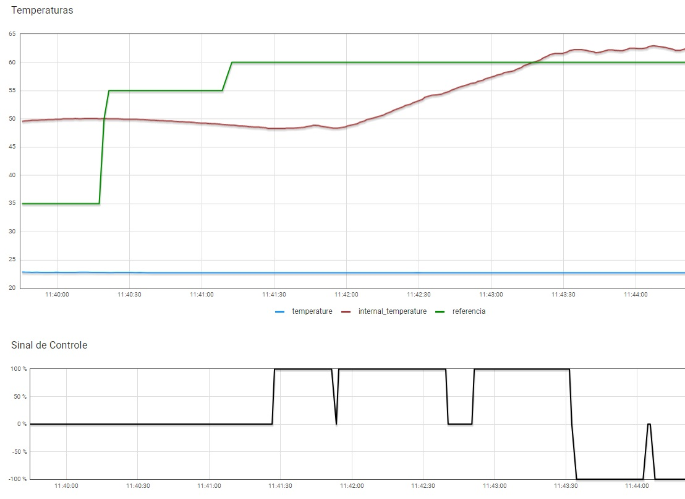
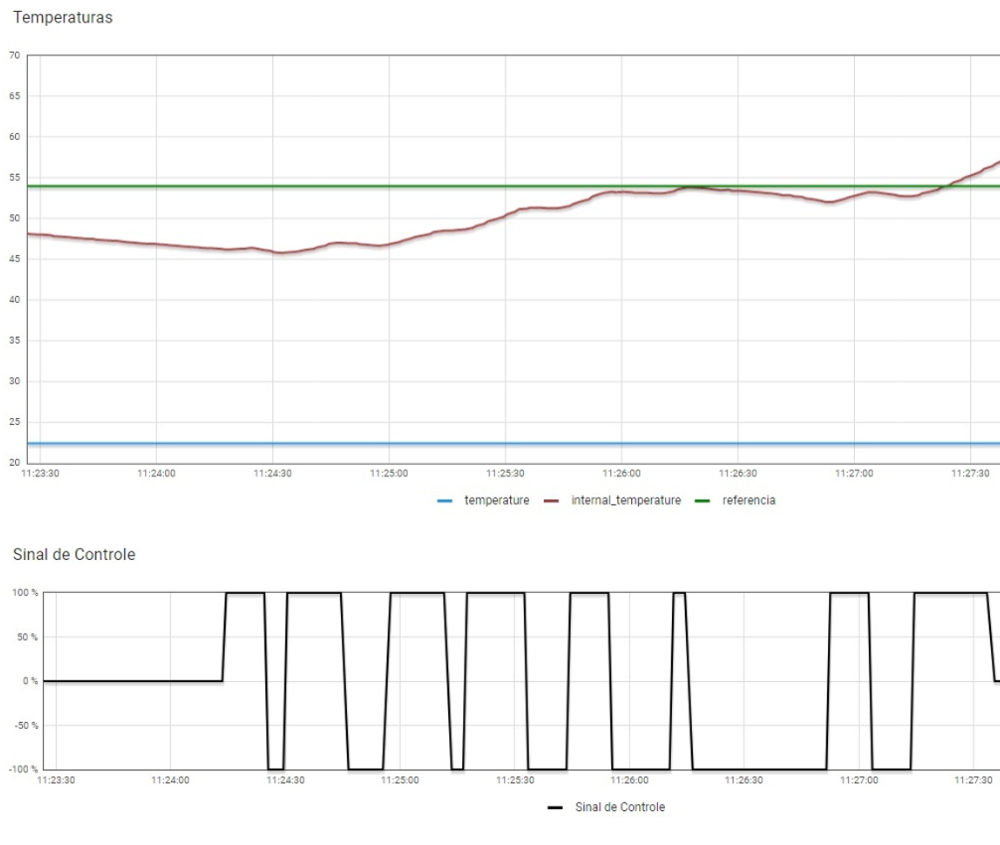

# FSE-Trabalho-2
Trabalho para desenvolver um sistema que simula o controle de um forno para soldagem de placas de circuito impresso (PCBs). No trabalho, o software a ser desenvolvido efetua o controle de temperatura do forno utilizando dois atuadores para este controle: um resistor de potência de 15 Watts utilizado para aumentar temperatura e; uma ventoinha que puxa o ar externo (temperatura ambiente) para reduzir a temperatura do sistema. São utilizadas conexões a Raspberry pi, comunicação serial UART e utilização do sensor BME280 via protocolo I2C.

Nome: Gabriel Alves Hussein
Matrícula: 17/0103200

## Instalação

Para instalar é necessário apenas utilizar o comando <code>make</code>:

```bash
make
```

## Execução

Para realizar execução é só ir na pasta bin e executar o bin gerado pelo <code>make</code>

```bash
bin/bin
```

## Modo de Uso

Para testes foram utilizados a RASP 47 e interação via Dashboard do forno 03 pelo ThingsBoard.

Os acionamentos dos botões no dashboard refletem na livestream disponibilizada pelo professor assim como no terminal onde há a disponibilização de informações de acontecimentos do sistema.

## Experimentos

O experimento a seguir foi feito durante 4 minutos, onde por 1 minuto e meio o forno se manteve desligado com a temperatura de referência sendo incrementada manualmente até 60°C e logo após o aquecimento foi inicializado, mantendo o resistor (sinal de controle 100%) ligado até a ultrapassagem da temperatura interna em relação a temperatura de referência, então é feita a inversão dos atuadores e o resistor é desligado dando lugar para a ventoinha (sinal de controle -100%), a margem de erro para resposta dos atuadores se dá pelo delay de 2 segundos implementado a cada iteração da leitura de temperaturas para melhor análise dos acontecimentos, o resultado foi satisfatório pois a temperatura interna se manteve perto da temperatura de referência sem aquecer demais.



Este segundo experimento a seguir foi feito também durante 4 minutos porém neste caso os sensores de temperatura interna e temperatura de referência estavam constantemente enviando temperaturas negativas -1°C para o sistema o que fazia com que os atuadores ativassem o tempo todo criando uma curva de temperatura muito menos constante e suave do que a do primeiro experimento, para o resultado visto no experimento 1 foi implementado um tratamento para o envio de temperaturas diferentes das apresentadas no dashboard.

